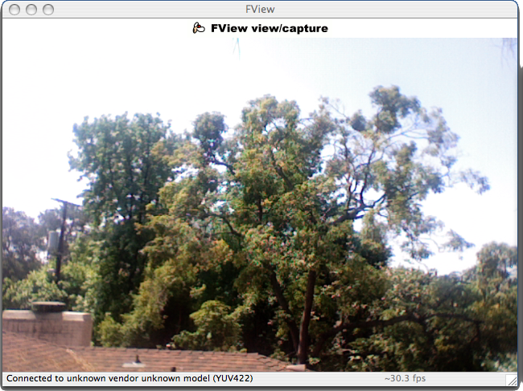
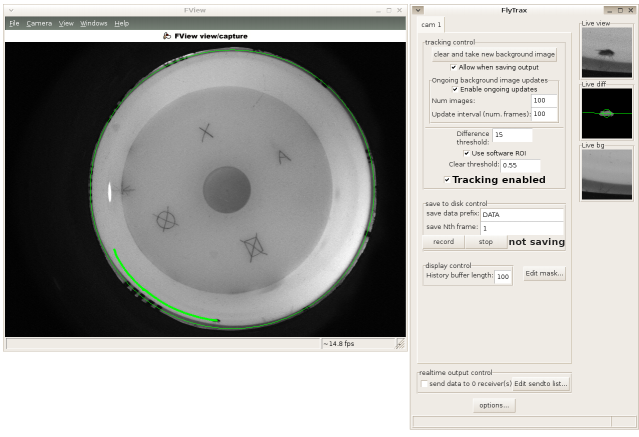
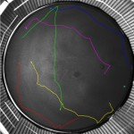

.. _applications:

************************************************
Gallery of applications built on motmot packages
************************************************

Open source
===========

FView - Extensible realtime image viewing, saving, and analysis app
-------------------------------------------------------------------

The :mod:`fview` application makes use of motmot components to create
a realtime camera viewer program that can record videos to disk. It
includes a convenient plugin mechanism by which realtime video
analysis can be performed. FView runs on Linux, Mac OS X, and
Windows. This application is essentially a GUI frontend for
:mod:`cam_iface` built using the wx toolkit.  You may be interested in
visiting the `screenshot directory`__.  It may optionally use our
inexpensive, custom integrated :ref:`fview_ext_trig-overview`. Here is
a screenshot of fview running on Mac OS X using an iSight camera:

__ http://code.astraw.com/projects/motmot/trac/browser/trunk/fview/screenshots

.. _flytrax-screenshot:

fview and flytrax screenshot
""""""""""""""""""""""""""""

Here is another screenshot of fview and the :mod:`flytrax` realtime
image analysis plugin. Note that the plugin is draws on the main
display and to its own GUI window, which allows the user to interact
with the online processing.

* :mod:`flytrax` is a realtime tracking system to track moving image
  features (a walking fly) using a simple but fast
  background-subtraction algorithm. Flytrax is freely available,
  open-source software distributed as part of the motmot package and
  functions as a plugin for :command:`fview`.

ctrax - the Caltech Multiple Fly Tracker
----------------------------------------

* ctrax__ is multiple fly tracking software to enable quantitative
  analysis of fly behavior. From recorded videos, it tracks flies
  using a background/foreground model to track positions and
  orientations of individual flies over time. Identies of flies are
  maintained for long durations, with special care given to events
  such as close contact between flies and rapid movements. ctrax is
  free, open-source software.

__ http://www.dickinson.caltech.edu/ctrax 

trackem - Realtime multi-point tracker
--------------------------------------

* :mod:`trackem` tracks multiple bright or dark points and is used in
  our `insect inspired flight control testbed`__

__ http://www.its.caltech.edu/~astraw/research/#id7

Closed source
=============

Flydra - Realtime multi-camera tracking of multiple flying animals
------------------------------------------------------------------

* Flydra__ is a realtime tracking system for performing marker-less
  tracking of moving image features, such as flying insects or
  birds. This multi-camera system uses, at its core, the motmot
  packages running simultaneously on multiple computers connected to
  multiple cameras to enable high spatial and temporal resolution in a
  large tracking volume with standard commercial components.

__ http://dickinson.caltech.edu/Research/MultiTrack 

Contact Andrew Straw astraw@caltech.edu to add your project to this list.