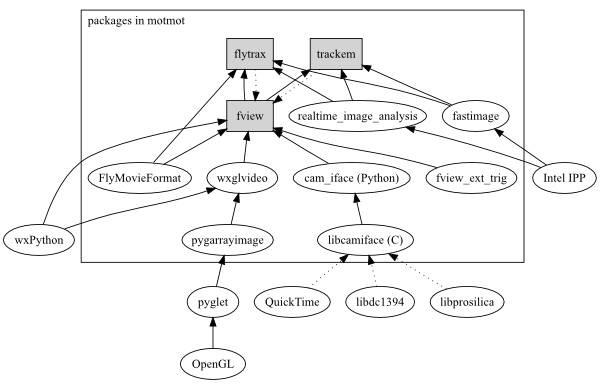

************************************
Motmot camera utilities introduction
************************************

Motmot is software for the realtime collection and analysis of
uncompressed digital images from a variety of sources. The target
audience ranges from anyone needing a simple GUI to record video to
the developer wanting to implement a new realtime vision algorithm
within an open, plugin-based environment. A primary goal is high
throughput and low latency for use in realtime applications. We
routinely use these libraries to process data from cameras with data
rates up to 60 MB per second (with processing power to spare) on
commodity hardware.

The program :mod:`fview` is a high-level application for viewing
camera output, adjusting camera parameters, streaming video to disk,
and providing an interface for that realtime processing routines can
plugin to. Much of the rest of motmot is a modular set infrastructure
components for FView or plugins that utilize FView.

The primary language is Python_, but the low-level camera access
library (:ref:`libcamiface <libcamiface>`) is in C. Lots of heavy
lifting happens using numpy_, C libraries utilizing SIMD instructions,
or custom C code.

There is also firmware for a $30 USB device to :ref:`trigger frame
acquisition and sample analog inputs with precise timing
<fview_ext_trig-overview>`.

.. :ref:`trigger camera frame acquisition and acquire analog input data with precise timing <fview_ext_trig_overview>`.

.. _Python:  http://python.org/
.. _numpy: http://numpy.scipy.org/

Motmot is open source software under the BSD license. Because the
majority of development happens on Ubuntu Linux, this is the best
supported operating system. The components do work on Windows and Mac
OS X, although binary packages for these platforms are not currently
provided.

  Relationships of important motmot components. Python and numpy are
  required for almost all modules, and are not shown. Shaded
  rectangular nodes are GUI components, while rounded nodes are
  libraries in C, C++, or Python. Dotted arrows indicate an optional
  dependency (plugin relationship) rather than a hard dependency.

This software was developed by `Andrew Straw`__ within the `Dickinson
Lab`__ at Caltech__ to facilitate experiments in the neurobiology,
biomechanics and aerodynamics of the fruit fly, *Drosophila
melanogaster*.

__ http://www.its.caltech.edu/~astraw/
__ http://www.dickinson.caltech.edu/
__ http://www.caltech.edu/

.. toctree::
  :maxdepth: 1

  overview.rst
  applications.rst
  camtrig/OVERVIEW.rst
  packages.rst
  citations.rst

Indices and tables
==================

* :ref:`genindex`
* :ref:`modindex`
* :ref:`search`
